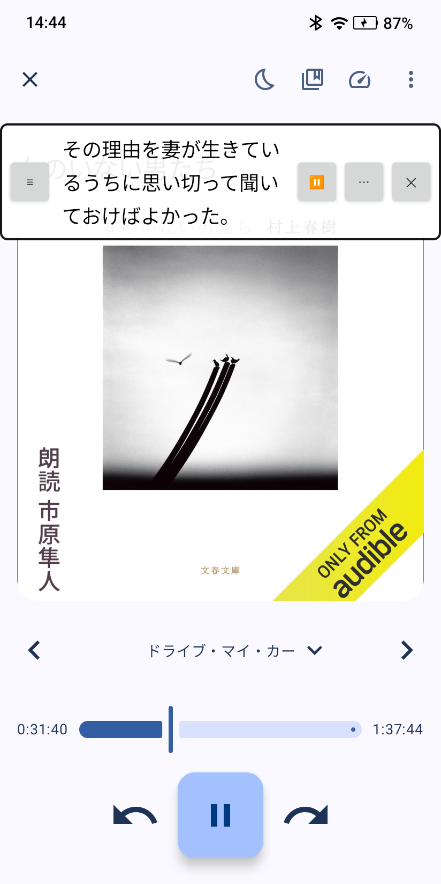
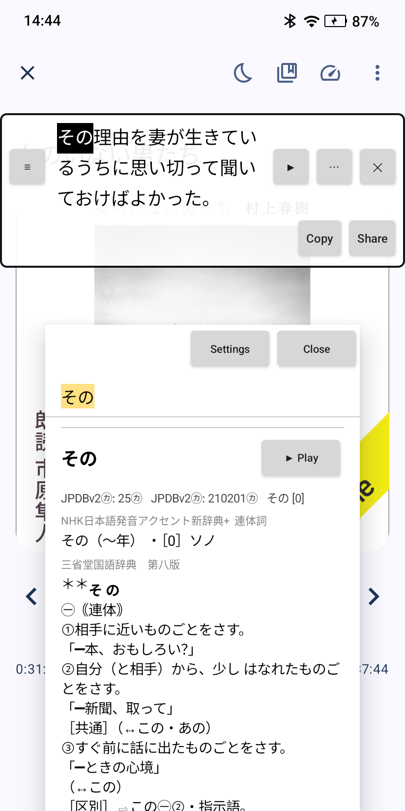

# SubRead Overlay

Shows the lines of a subtitle file (`.srt`) over the app that plays your
audiobook or video. The line follows the position of the player. Tap a word to
select it, and send it to a dictionary.

It works with each Android player that publishes a media session: Voice, VLC,
mpv-android, YouTube, Smart AudioBook Player, podcast apps. No player needs a
change, and the app has no network permission.

No `.srt` for your audiobook? [SubRead](https://subread.space) makes one from
the audiobook and its ebook, in the browser or on
[Android](https://github.com/equwal/subread-android).

## Screenshots

<p>
  
  
</p>

The pictures are from a Viwoods AiPaper Reader, with Voice as the player.

## How to use it

1. Allow "Show over other apps".
2. Allow notification access. Android gives the position of other apps only to
   an app with this access. The app uses it for the media position, the speed,
   and play or pause. It does not read, keep or send a notification: the
   listener has no `onNotificationPosted`.
3. Choose the `.srt` file.
4. Choose the dictionary for "Look up", or let Android ask each time. Each app
   that has an entry in the text selection menu is in the list (Takoboto,
   Aedict, AnkiDroid, a translator).
5. Press "Show the subtitles", then start the player.

Two settings change the panel: how much of the player shows through it, and
whether it shows the line before and the line after the line of now.

On the panel:

- `≡` moves the panel.
- A tap on a word pauses the player at once and selects the word. A drag
  selects more words. When the finger lifts, the selection goes to the
  dictionary. "Share" opens the share sheet of Android, for an app without an entry in
  the text selection menu. "Copy" copies it.
- `▶` starts the player again after a lookup. `⏸` pauses it.
- `⋯` opens the timing row. `−0.5 s` and `+0.5 s` shift the subtitles.
  `◀ line` and `line ▶` make the line before, or the next line, the line of
  now. Use them when the media has an intro that the subtitle file does not
  have.
- `✕` closes the panel.

The line stays on the panel until the next line starts, also in a silence, so
that there is time to look a word up.

## How the timing works

A media session reports a position, the time of that report, and the speed.
`PlayClock` computes the position of now from these three. `Follower` sleeps
until the next line starts and wakes on each report of the player (pause,
seek, speed). It does not poll.

A player that reports no position: Android counts from zero when that player
starts to play, and the panel holds its line in a pause. Set the timing with
`◀ line` and `line ▶`.

The app does not use an accessibility service, and will not. Players that
hide their position (Netflix, some DRM players) are not supported.

## Anki cards

With [SubRead Anki](https://github.com/equwal/subread-anki) installed, the
selection row has an "Anki" button. One tap makes a card in AnkiDroid: the
word, its reading and definition (from SubRead Dictionary), the line as the
sentence, a screenshot of the player, the word audio and the line read by the
voice of the device. The panel hides for a moment so that the screenshot shows
the player. SubRead Anki has its own optional capture service; this app stays
without one.

A book in many audio files: the player reports the position in the current
file, and the subtitle file has one clock for the whole book. Shift the
subtitles with the timing row at the start of each file. One `.m4b` for one
book has no such problem.

## For reader apps

A reader app has no notification access, so it cannot see the position of
the player. This app answers for it, with a content provider at
`content://space.subread.overlay.player/state`. A query returns one row with
the column `state`:

```
playing=1;position=96153;speed=1.0;package=de.ph1b.audiobook
```

The position is in milliseconds, for the moment of the query. A problem is
`error=no_notification_access` or `error=no_player`. `call` with the method
`play`, `pause` or `seek` (the argument is the position in milliseconds)
controls the player. The panel does not need to be on the screen.

The [SubRead plugin for KOReader](https://github.com/equwal/subread.koplugin)
uses this to turn the pages with the audiobook.

## For flash card apps

A query of `content://space.subread.overlay.player/line` returns one row: the
subtitle line of now, with the report of the player as it came, so that a
flash card app can put the line on a card and cut its sound. The columns:

- `state`: the same line as `/state`.
- `reported_position`, `reported_at`, `speed`, `playing`: the last report of
  the player. `reported_at` is on the clock of `SystemClock.elapsedRealtime()`.
  A pause reported a minute ago still maps each time of the media to the
  moment it played.
- `offset`: the shift the user set. A time of the subtitle file is `offset`
  milliseconds later than the same moment of the player.
- `index`, `start`, `end`, `text`, `before`, `after`: the line. `index` is -1
  before the first line, and `text` is then null. The times are on the clock
  of the subtitle file.

The query parameter `position` (milliseconds, on the clock of the player)
picks the line for that position in place of the position of now. The panel
does not need to be on the screen, but the user must have chosen the `.srt`.

[SubRead Anki](https://github.com/equwal/subread-anki) uses this. Choose it
as the dictionary in step 4: a tap on a word then makes a card with the line,
its sound and a picture of the screen.

## For caption apps

An app that makes captions from live audio, for example speech recognition of
the sound of a video, can show its lines on the panel. The user then taps the
words and looks them up, the same as with a subtitle file. The app calls the
same content provider:

```kotlin
val panel = Uri.parse("content://space.subread.overlay.player")
contentResolver.call(panel, "line", "It was a dark", bundleOf("partial" to true))
contentResolver.call(panel, "line", "It was a dark night.", null)
contentResolver.call(panel, "end", null, null)
```

`line` shows the text. The extra `partial` is true while the sentence goes on:
the panel adds `…` to the line, and the next line replaces it. A final line
(no `partial`) stays as the line before, when the user shows three lines. `end`
gives the panel back to the subtitle file. Without `end`, live lines end ten
minutes after the last one.

The answer is in the bundle key `live`: `ok`, or the reason the panel cannot
show the line. `no_notification_access` and `no_overlay_permission`: the user
must allow steps 1 and 2. `panel_hidden`: the user must press "Show the
subtitles", or closed the panel with `✕`. The panel does not come back on its
own for a line, so that a close stays a close.

While a word is selected, the panel holds the line, so that the lookup has
time. The newest line comes when the selection goes.

From a shell, for a test:

```
adb shell content call --uri content://space.subread.overlay.player --method line --arg "It was a dark" --extra partial:b:true
```

## Build

```
./gradlew :core:test :app:assembleDebug
./gradlew :app:connectedDebugAndroidTest   # word selection and the follower, on a device
```

`:core` is plain Kotlin: the subtitle reader, the line for a position, the
clock. It has property tests. `:app` has the panel and the listener.

`-PplayStore=true` leaves the Ko-fi link out of the build for Google Play.

## Licence

AGPL-3.0. See `LICENSE`.
